# 📚 管理后台使用手册

> **VitePress Blog Starter 后台管理系统完全指南**

本手册将详细介绍如何使用博客的管理后台，包括文章管理、分类管理、标签管理、封面上传等核心功能。

---

## 📑 目录

- [访问后台](#访问后台)
- [后台首页](#后台首页)
- [Markdown编辑器](#markdown编辑器)
  - [创建新文章](#创建新文章)
  - [编辑现有文章](#编辑现有文章)
  - [图片上传](#图片上传)
  - [文章发布](#文章发布)
- [文件管理](#文件管理)
  - [草稿管理](#草稿管理)
  - [文章列表](#文章列表)
  - [回收站](#回收站)
- [标签管理](#标签管理)
- [配置管理](#配置管理)
- [常见问题](#常见问题)

---

## 访问后台

### 启动开发服务器

首先需要启动开发服务器：

**Windows 用户：**
```bash
# 双击运行
start.bat

# 或在命令行中运行
pnpm dev
```

**macOS/Linux 用户：**
```bash
# 在终端中运行
./start.sh

# 或直接使用 pnpm
pnpm dev
```

### 访问后台地址

服务启动成功后，在浏览器中访问：

```
http://localhost:5173/tools/admin
```

---

## 后台首页

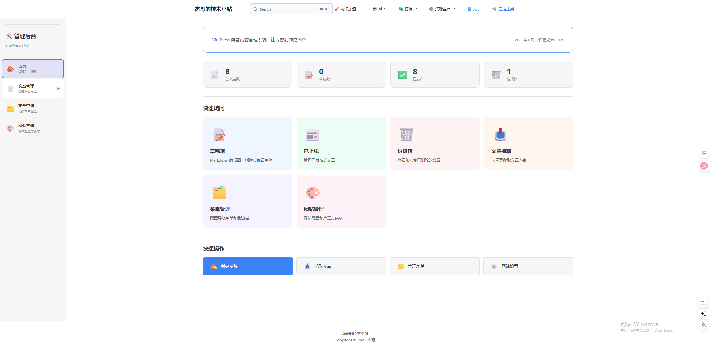

后台首页提供了整个系统的概览：

- **📊 统计数据**：显示草稿、已发布文章、回收站的数量
- **🎨 主题设置**：切换主题色
- **📝 快速入口**：快速访问编辑器、文章列表等功能

---

## Markdown编辑器

### 创建新文章

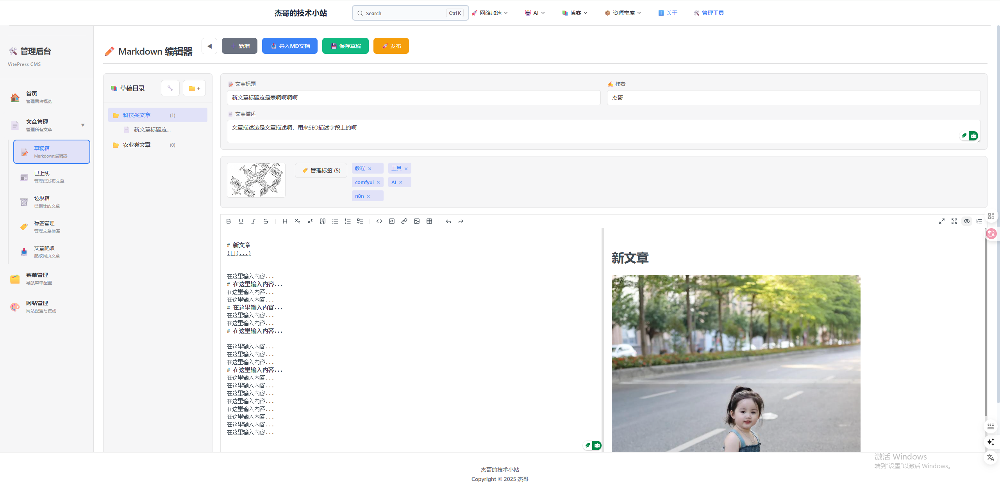

点击「新建文章」按钮开始创建：

1. **填写文章元信息**：
   - 标题（必填）
   - 描述（必填）
   - 作者（必填）
   - 分类（可选）
   
2. **选择封面图片**：
   - 点击封面区域上传图片
   - 支持 JPG、PNG、GIF、WebP 格式
   - 推荐尺寸：1200x630px

3. **选择标签**：
   - 点击「管理标签」选择或添加标签
   - 支持多选

### 编辑器界面

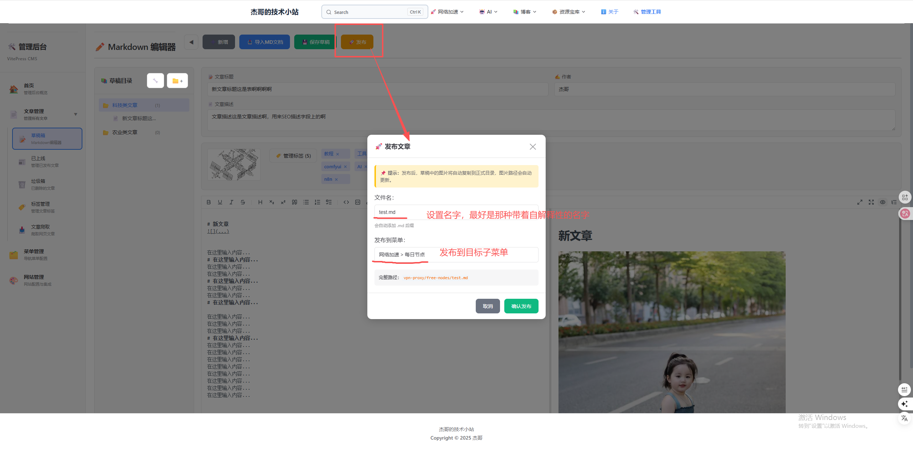

Markdown 编辑器功能强大且易用：

**工具栏功能：**
- **格式化工具**：粗体、斜体、删除线
- **标题工具**：H1-H6 标题
- **列表工具**：有序列表、无序列表、任务列表
- **插入工具**：链接、图片、代码块、表格
- **撤销/重做**：支持操作历史
- **全屏模式**：专注写作

**实时预览：**
- 左侧编辑区：Markdown 源码
- 右侧预览区：实时渲染效果
- 同步滚动：编辑和预览自动同步

### 图片上传

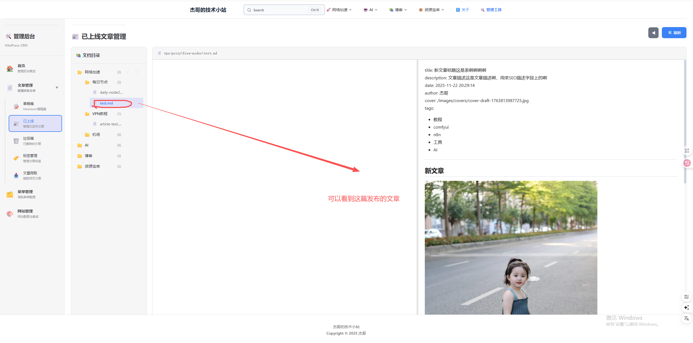

编辑器支持多种图片上传方式：

**方式 1：工具栏上传**
1. 点击工具栏的图片图标
2. 选择本地图片文件
3. 等待上传完成
4. 图片自动插入到编辑器中

**方式 2：拖拽上传**
1. 从文件管理器拖拽图片到编辑器
2. 自动上传并插入

**方式 3：粘贴上传**
1. 复制图片到剪贴板
2. 在编辑器中按 Ctrl+V（Windows）或 Cmd+V（macOS）
3. 自动上传并插入

**上传限制：**
- 单个文件最大 10MB
- 支持格式：JPG、PNG、GIF、WebP
- 图片自动保存到 `docs/public/images/uploads/`

### 文章元信息

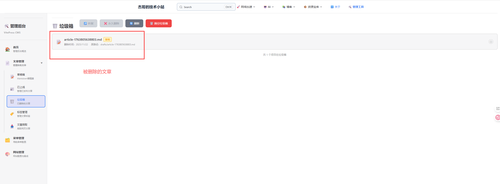

在编辑器顶部配置文章的元信息：

**必填字段：**
- **标题**：文章标题，用于SEO和显示
- **描述**：文章摘要，显示在卡片和搜索结果
- **作者**：文章作者名称

**可选字段：**
- **分类**：文章分类（自动根据保存路径生成）
- **标签**：文章标签（多选）
- **封面**：文章封面图片

### 封面上传

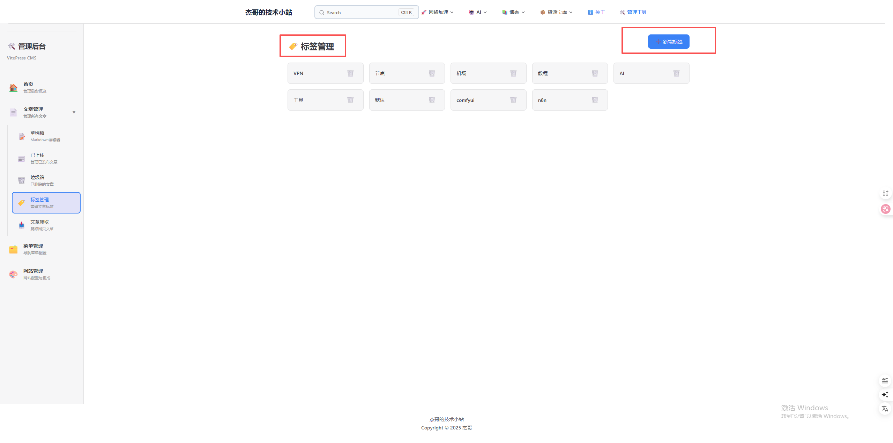

为文章设置吸引人的封面图：

1. 点击封面上传区域
2. 选择图片文件
3. 预览上传的封面
4. 点击已上传的封面可以重新选择

**封面图建议：**
- 推荐尺寸：1200x630px（16:9 比例）
- 文件格式：JPG 或 PNG
- 文件大小：建议 < 500KB
- 图片清晰：确保在缩略图下也清晰可见

### 标签选择

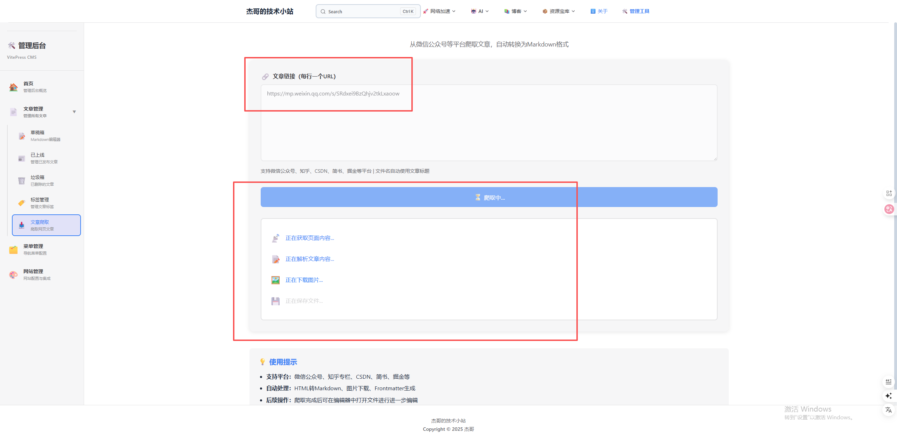

为文章添加标签以便分类和搜索：

1. 点击「管理标签」按钮
2. 在弹出的对话框中选择标签
3. 可以选择多个标签
4. 选中的标签会显示在标签区域

**标签管理技巧：**
- 标签需要在「标签管理」页面中预先创建
- 支持多标签筛选（OR 逻辑）
- 标签名建议简短且有意义

### 文章发布

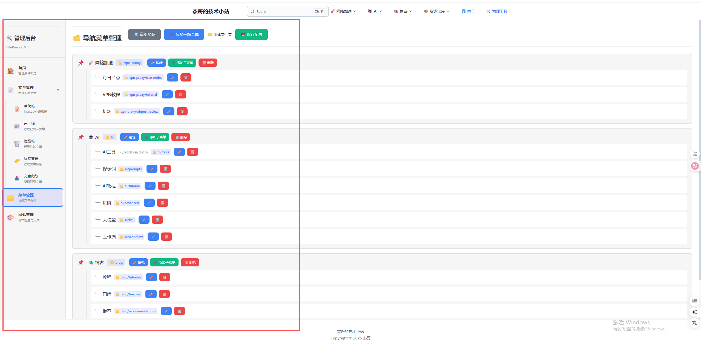

完成文章编写后，进行发布操作：

**发布流程：**

1. **点击「发布文章」按钮**
   - 系统会自动验证必填字段
   - 保存草稿到本地

2. **选择发布路径**
   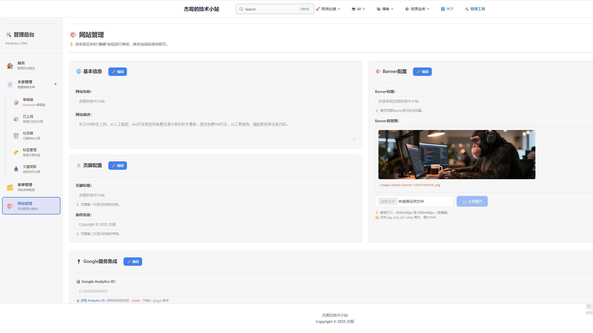
   - 选择文章所属分类文件夹
   - 支持创建新文件夹
   - 路径决定了文章的URL和分类

3. **确认发布**
   - 文章将从草稿箱移动到正式目录
   - 草稿文件和草稿图片会被删除
   - 文章立即在网站上可见

**发布后：**
- 文章保存到 `docs/posts/` 对应分类下
- 自动生成漂亮的 URL
- 在首页和分类页面显示

---

## 文件管理

### 草稿管理

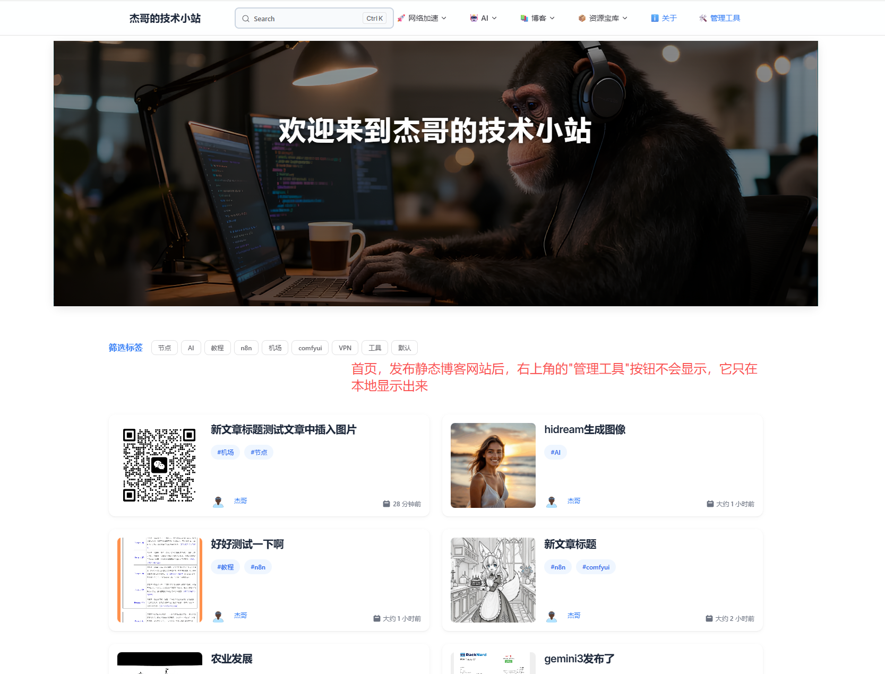

草稿箱保存了所有未发布的文章：

**草稿列表功能：**
- **查看草稿**：显示所有草稿的标题和修改时间
- **编辑草稿**：点击草稿名称继续编辑
- **删除草稿**：将草稿移到回收站
- **自动保存**：编辑时自动保存草稿

**草稿存储位置：**
```
docs/posts/.drafts/
├── draft-1732xxx.md
├── draft-1732yyy.md
└── ...
```

### 文章列表

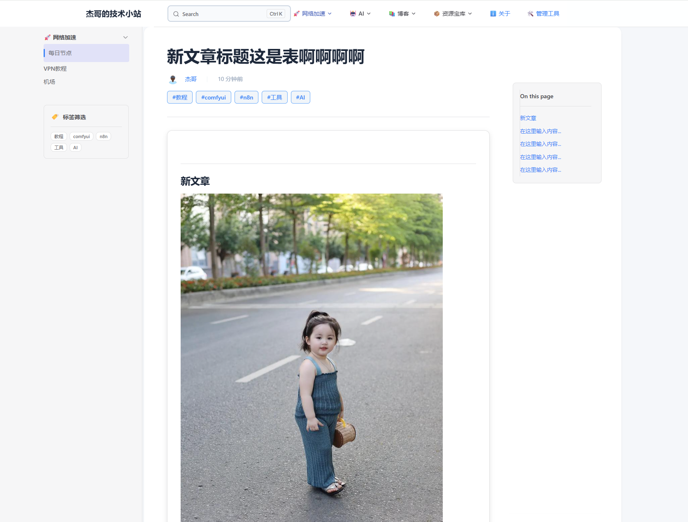

查看和管理已发布的文章：

**列表功能：**
- **文章浏览**：查看所有已发布文章
- **分类筛选**：按分类过滤文章
- **搜索功能**：按标题搜索文章
- **编辑文章**：点击文章进入编辑器
- **删除文章**：将文章移到回收站

**批量操作：**
- 支持批量删除（移到回收站）
- 支持批量修改分类（未来功能）

### 回收站

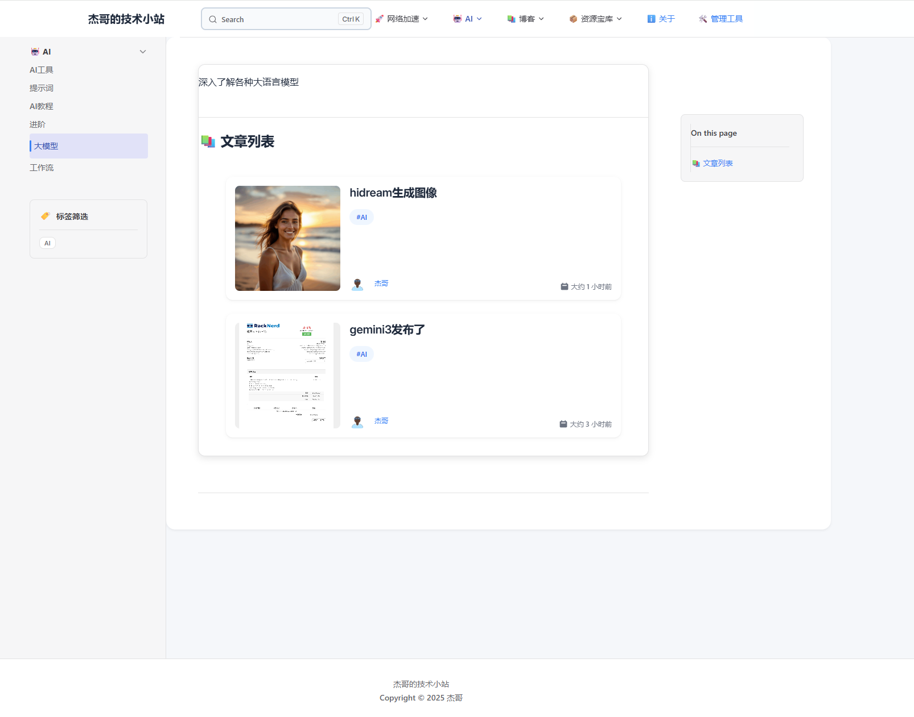

回收站保存了被删除的文章和草稿：

**回收站功能：**
- **查看已删除项**：显示所有已删除的文件
- **恢复文件**：将文件恢复到原位置
- **永久删除**：彻底删除文件（不可恢复）
- **清空回收站**：一键清空所有已删除文件

**注意事项：**
- 回收站的文件可以随时恢复
- 永久删除后无法恢复
- 建议定期清理回收站

**回收站位置：**
```
docs/posts/.trash/
├── deleted-article-1.md
├── deleted-draft-2.md
└── ...
```

---

## 标签管理

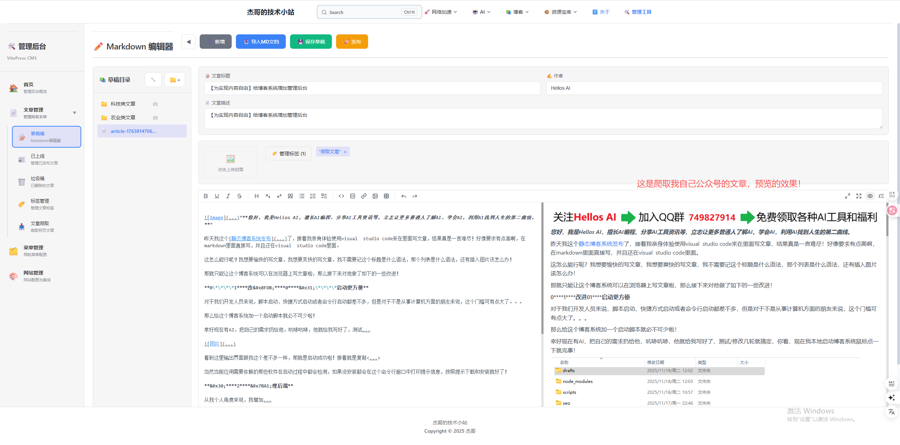

集中管理所有文章标签：

### 添加新标签

1. 在输入框中输入标签名称
2. 点击「添加」按钮
3. 标签立即出现在标签列表中

### 删除标签

1. 找到要删除的标签
2. 点击标签旁的「✕」按钮
3. 确认删除

### 标签最佳实践

**标签命名建议：**
- 使用简短、有意义的名称
- 避免重复或相似的标签
- 使用统一的命名规范（如：全小写）

**标签分类建议：**
- **技术类**：VPN、AI、教程、工具
- **内容类**：免费、推荐、测评、资源
- **难度类**：入门、进阶、高级

**标签数量控制：**
- 每篇文章建议 3-5 个标签
- 系统标签总数建议控制在 50 个以内
- 定期清理未使用的标签

---

## 配置管理

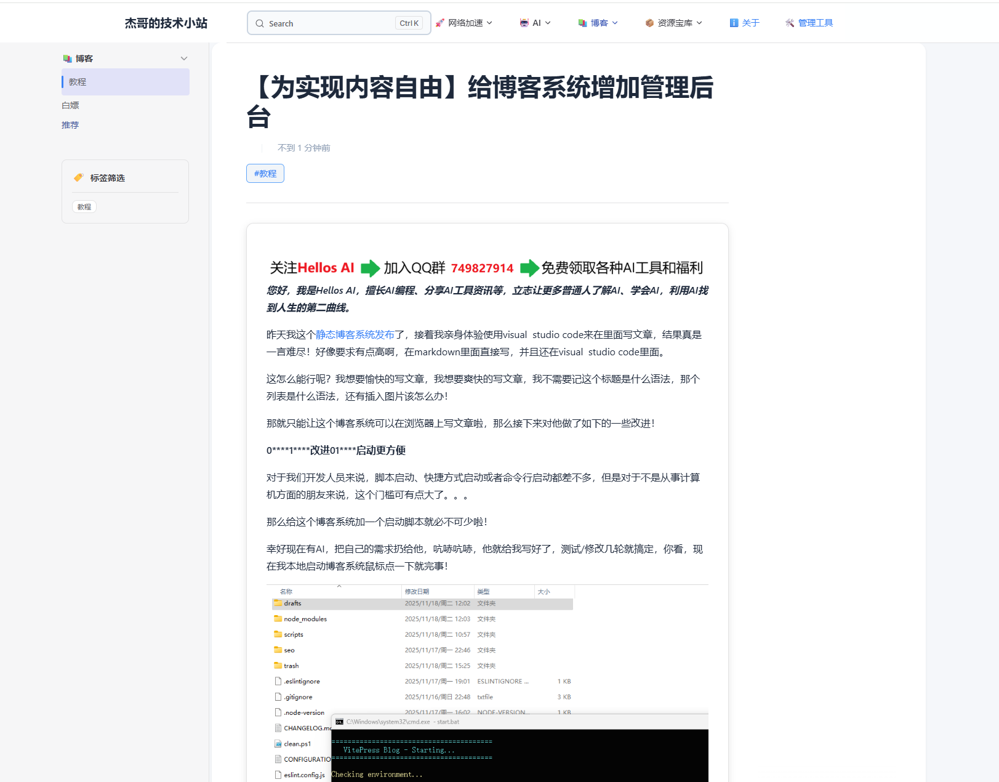

后台配置页面提供系统级设置：

### 主题设置

- **主题色**：切换网站主题颜色
- **字体大小**：调整默认字体大小
- **语言设置**：切换界面语言（暂未实现）

### 网站配置

- **网站名称**：修改网站标题
- **网站描述**：修改网站描述
- **作者信息**：管理作者列表

### SEO 配置

- **Meta 标签**：配置默认 meta 标签
- **Google Analytics**：设置 GA4 ID
- **Google AdSense**：设置广告ID

### 其他设置

- **评论系统**：配置评论插件（未来功能）
- **社交分享**：配置分享按钮
- **备份恢复**：数据备份和恢复

---

## 常见问题

### Q1: 编辑器无法输入中文？

**A:** 这可能是输入法冲突。解决方法：
1. 刷新页面重试
2. 切换到其他输入法再切回来
3. 使用纯英文输入法输入后再复制粘贴中文

### Q2: 图片上传失败？

**A:** 检查以下几点：
1. 图片大小是否超过 10MB
2. 文件格式是否为JPG、PNG、GIF、WebP
3. 后端服务是否正常运行（`http://localhost:3456`）
4. 检查控制台是否有错误信息

### Q3: 文章发布后看不到？

**A:** 可能的原因：
1. 检查文章是否成功保存到 `docs/posts/` 目录
2. 刷新浏览器缓存（Ctrl+F5）
3. 检查文章的 frontmatter 是否正确
4. 重启开发服务器

### Q4: 如何备份文章数据？

**A:** 文章数据保存在文件系统中：
1. 所有文章位于 `docs/posts/` 目录
2. 使用 Git 进行版本控制
3. 定期提交并推送到远程仓库
4. 或直接复制整个 `posts` 文件夹备份

### Q5: 如何添加新的作者？

**A:** 在 `docs/blog/authors/` 下创建作者信息：
1. 创建一个以作者名命名的文件夹
2. 在文件夹中创建 `index.md` 文件
3. 填写作者信息（姓名、头像、简介等）

### Q6: 如何修改文章分类？

**A:** 文章分类由文件路径决定：
1. 移动文章文件到新的分类文件夹
2. 或在发布时选择不同的保存路径
3. 文章 URL 会随分类路径改变

### Q7: 草稿自动保存频率？

**A:** 草稿保存机制：
- 编辑时自动保存（防丢失）
- 每次修改标题、描述、标签等元信息时保存
- 点击「发布」或「保存草稿」按钮手动保存

### Q8: 如何恢复误删除的文章？

**A:** 使用回收站功能：
1. 访问「回收站」页面
2. 找到被删除的文章
3. 点击「恢复」按钮
4. 文章会恢复到原来的位置

---

## 💡 使用技巧

### 快捷键

编辑器支持常用的 Markdown 快捷键：

- `Ctrl/Cmd + B`：加粗
- `Ctrl/Cmd + I`：斜体
- `Ctrl/Cmd + K`：插入链接
- `Ctrl/Cmd + S`：保存草稿
- `Ctrl/Cmd + Z`：撤销
- `Ctrl/Cmd + Shift + Z`：重做

### 工作流程建议

**推荐的文章创建流程：**

1. 📝 **创建草稿** → 先保存为草稿，慢慢完善
2. 🖼️ **添加封面** → 选择吸引眼球的封面图
3. 🏷️ **选择标签** → 添加 3-5 个相关标签
4. ✍️ **编写内容** → 使用 Markdown 语法
5. 🔍 **预览检查** → 确保格式正确
6. 📊 **SEO 优化** → 填写标题、描述、关键词
7. 🚀 **发布文章** → 选择分类并发布

### 内容创作建议

**文章标题：**
- 控制在 60 字符以内（利于SEO）
- 包含关键词
- 吸引读者点击

**文章描述：**
- 控制在 160 字符以内
- 简明扼要总结内容
- 包含目标关键词

**文章内容：**
- 使用清晰的标题层级（H1-H6）
- 适当添加图片和代码块
- 段落不宜过长
- 使用列表增加可读性

---

## 📞 获取帮助

如果遇到问题或有建议，欢迎：

- 🐛 **报告问题**：[GitHub Issues](https://github.com/tansunyj/vitepress-blog-starter/issues)
- 💬 **加入社区**：扫描 README.md 中的 QQ 群二维码
- 📧 **联系作者**：通过邮件或社交媒体

---

<p align="center">
  <strong>Happy Blogging! 🎉</strong>
</p>
